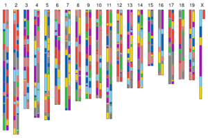
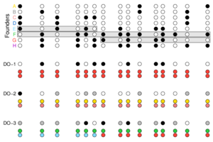

## Figures

  
[`do_cross.pdf`](do_cross.pdf) - illustration of the generation of
Diversity Outbred mice

  
[`do_genome.pdf`](do_genome.pdf) - illustration of the genome of a
simulated Diversity Outbred mouse

  
[`genoprobsA.pdf`](genoprobsA.pdf) to
[`genoprobsF.pdf`](genoprobsF.pdf) - set of 6 figures
illustrating the reconstruction of the DO genotypes
